# Kubernetes

Kubernetes merupakan platform open-source yang digunakan untuk melakukan manajemen workloads aplikasi yang dikontainerisasi, serta menyediakan konfigurasi dan otomatisasi secara deklaratif. Kubernetes berada di dalam ekosistem yang besar dan berkembang cepat. Service, support, dan perkakas Kubernetes tersedia secara meluas.

## Tujuan

- Deploy `Hello, World!` rest service menggunakan `golang` pada `minikube`.

## Hello, World!

`Hello, World!` disini adalah simple http service menggunakan golang yang kemudian dibungkus menjadi semua docker image dengan nama `iamucil/tcc-go` berdasarkan file yang ada di dalam repository ini.

```bash
.
├── build
├── cmd
│   └── blogrest
│       ├── Dockerfile
│       └── main.go
├── conf
├── go.mod
├── go.sum
├── README.md
├── resources
│   └── img
└── tools
```

Container image `iamucil/tcc-go` bersumber dari file `./cmd/blogrest/main.go` dan `./cmd/blogrest/Dockerfile`. Build image dengan perintah `docker build -t iamucil/tcc-go -f cmd/blogrest/Dockerfile .` dari root directory  atau berada satu level dengan file `go.mod` dan `go.sum` berada.

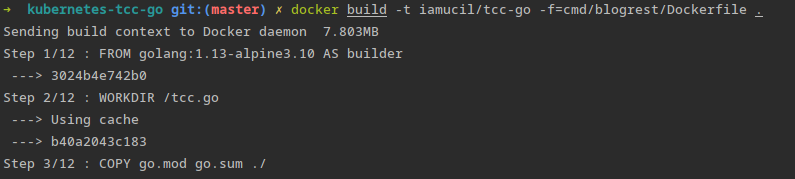
*docker build*

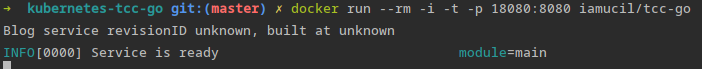
*test docker image dengan menjalankan container image*

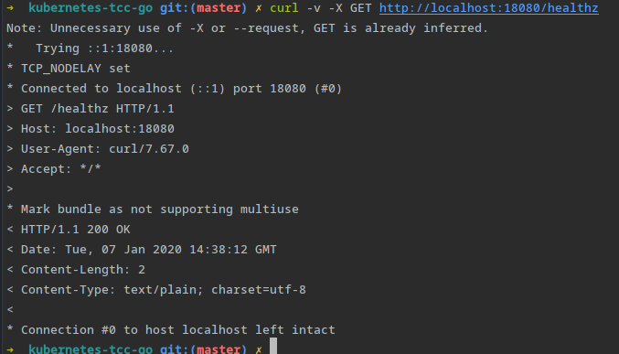
*Test akses `hello, world` app dengan curl dari terminal*

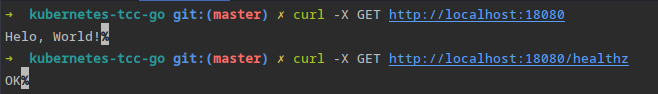
*curl response text*

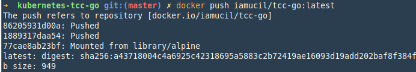
*push image ke docker.hub*

## Minikube

Instalasi minikube bisa dilihat pada tautan: [Installing Minikube](https://kubernetes.io/docs/tasks/tools/install-minikube/)

### Quickstart

1. Jalankan minikube dan buat cluster dengan perintah `minikube start`. Perintah `minikube start` digunakan untuk download cli kuberctl dan start komponen dari cluster.

    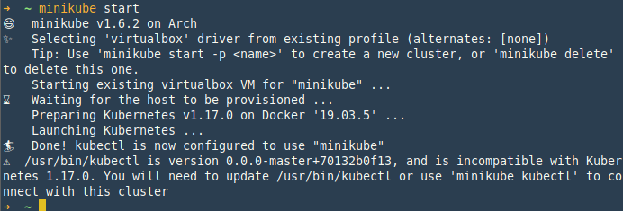

    Info lebih detail tentang menjalankan minikube di local bisa di lihat pada tautan: [Starting a Cluster](https://kubernetes.io/docs/setup/learning-environment/minikube/#starting-a-cluster)

    Kuberbetes juga memiliki dashboard berupa web untuk mengontrol melihat/memantau/mengontrol service-service yang terdaftar di dalam kubernetes.

    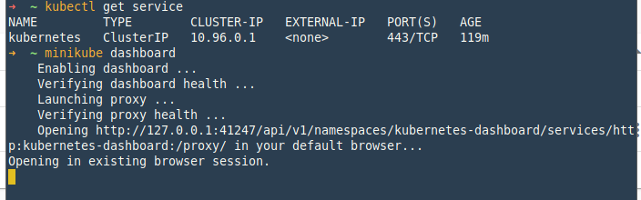

    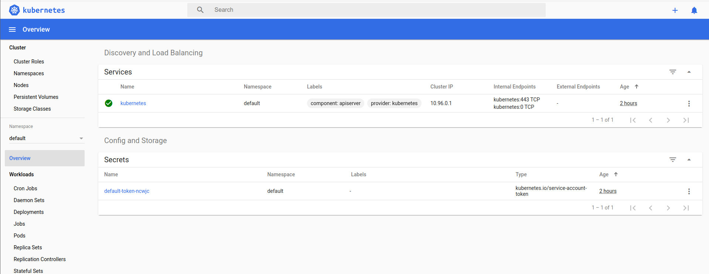
    *Tampilan web dashboard untuk mengontrol kubernetes*

2. Cluster sudah jalan dengan perintah `minikube start`, untuk berinteraksi dengan cluster, perintah yang digunakan adalah `kubectl`

    Jalankan perintah `kubectl get nodes` untuk melihat status dari node yang sudah dijalankan.

    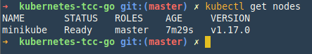

    Lanjut dengan membuat deployment container image yang sudah dibuat `iamucil/tcc-go` pada minikube. Simple `Hello, World!` HTTP Rest Service dan di akses melalui port 8080.

    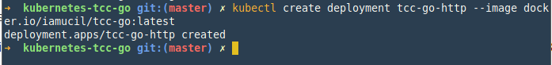

    Untuk mendapatkan status dari proses deployment dari kubectl, gunakan perintah kubectl get deployments, perintah ini akan menghasilkan output pada terminal seperti pada gambar dibawah ini:

    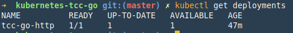

    sedangkan untuk mendapat status deployement spesifik berdasarkan nama:

    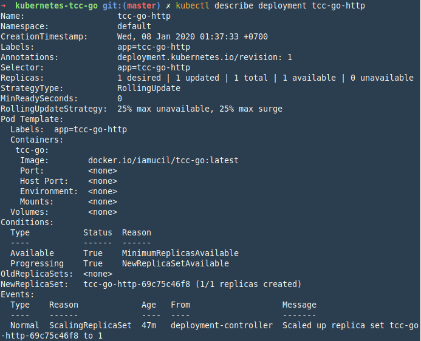

    perintah ini akan menghasilkan output yang lebih detail dari container yang di maksud, seperti yang terlihat pada gambar, terdapat informasi berapa replika yang berjalan, label, event yang berhubungan dengan container yang dijalankan.

3. Setelah deployment selesai dibuat, expose deployment sebagai service.

    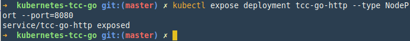

    `--type=NodePort` adalah type service, yaitu expose cluster ke static port sehingga service bisa di akses dari luar cluster menggunakan port. Untuk type lain bisa dilihat pada tautan: [Publishing Service(ServiceType)](https://kubernetes.io/docs/concepts/services-networking/service/#publishing-services-service-types)

4. Pod `tcc-go-http` sudah berhasil di jalankan, cek statud pod, tunggu sampai status `RUNNING` untuk bisa me-akses service.

    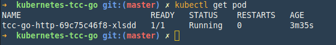

5. Dapatkan url dari service.

    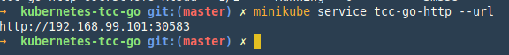

    Copy dan paste pada browser untuk mencoba apakah service sudah berjalan dengan semestinya, atau test menggunakan curl dari terminal.

    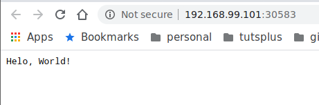

    Atau jalankan perintah `minikube service nama_service` perintah ini akan membuka browser secara otomatis. Jika default browser di set di dalam komputer.

    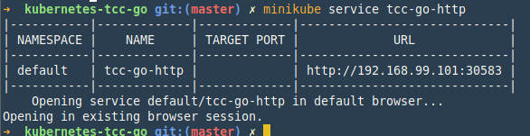

    > CURL\

    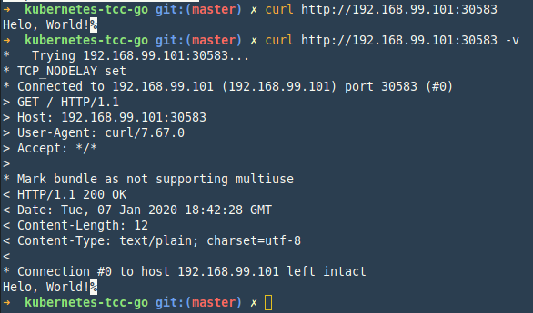

## Cleanup

Hapus layanan yang ada di dalam cluster yang tidak terpakai, untuk menghemat resource pc.

1. Hapus service `tcc-go-http`

    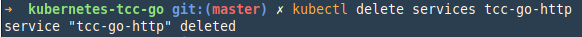

2. Hapus deployment `tcc-go-http`

    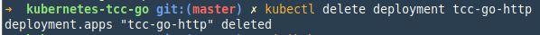

3. Stop cluster local

    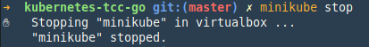

    Referensi: [Stoping a Cluster](https://kubernetes.io/docs/setup/learning-environment/minikube/#stopping-a-cluster)

4. Delete cluster local

    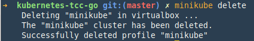

    Referensi: [Deleting a Cluster](https://kubernetes.io/docs/setup/learning-environment/minikube/#deleting-a-cluster)

> **Notes**\
Saat menggunakan satu VM untuk kubernetes, akan sangat membantu jika menggunakan Minikube’s built-in Docker daemon. Dengan menggunakan kembali daemon bawaan, kita tidak perlu lagi membuat docker registry dan push image ke repository, sehingga docker image bisa di build di dalam docker daemon yang sama dengan Minikube, dengan begitu akan mempercepat proses experiments di local. Pastikan tag dari image selain latest, sehingg ketika di kubectl di jalankan tidak mencari dari repository (defaultnya docker.hub). Untuk bisa mengintegrasikan dengan docker daemon jalankan perintah `eval $(minikube docker-env)`
